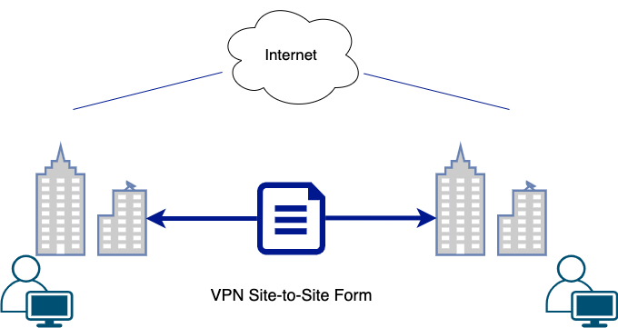
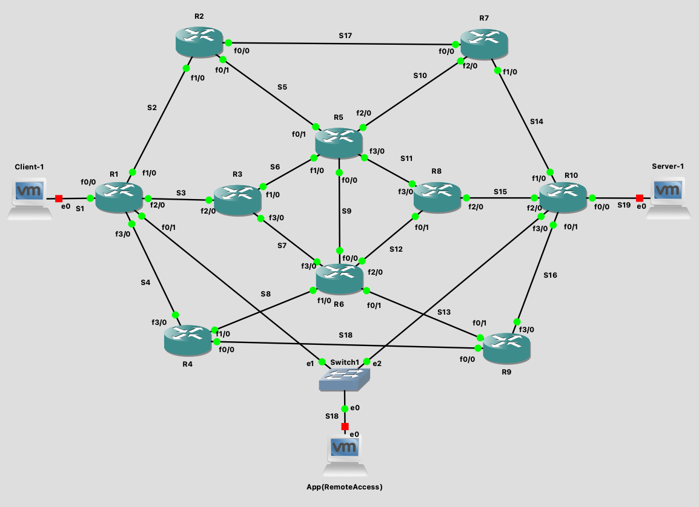

# Evaluating the Impact of Cryptographic Algorithms on Network Performance in Site-to-Site VPNs

**A GNS3 test framework and Python configuration tool for measuring how encryption algorithms and hash functions affect performance and security in site-to-site IPsec VPNs.**

[](https://www.python.org/)
[](https://www.paramiko.org/)
[](https://www.gns3.com/)
[](LICENSE)
[](#research-paper)

> **Final-year research project — BSc (Hons) Computer Science, University of West London (2024).**
> The accompanying paper, *"Evaluation of Security and Performance Impact of Cryptographic and Hashing Algorithms in Site-to-Site Virtual Private Networks,"* was published at the International Conference on Electrical and Computer Engineering Researches (**ICECER 2024**), Gaborone, Botswana.

<p align="center">
  
</p>

---

## Table of contents

- [Overview](#overview)
- [Why it matters](#why-it-matters)
- [Key findings](#key-findings)
- [The configuration tool](#the-configuration-tool)
- [Test topology](#test-topology)
- [Repository structure](#repository-structure)
- [Quick start](#quick-start)
- [Methodology in brief](#methodology-in-brief)
- [Security testing](#security-testing)
- [Limitations & ethics](#limitations--ethics)
- [Research paper](#research-paper)
- [Author](#author)
- [License](#license)

---

## Overview

Site-to-site VPNs secure traffic between geographically separated networks, and
the cryptography they use directly shapes both **how safe** and **how fast** that
traffic is. This project asks a practical question:

> *Which encryption + hash combinations give the best trade-off between security
> and transmission efficiency — and how much performance do you actually give up
> to be secure?*

To answer it, the project delivers two things:

1. **A reproducible virtual lab** — a ten-router Cisco topology in GNS3 with a
   client site, a server site and a management host, connected by a site-to-site
   IPsec tunnel between the two edge routers.
2. **A custom Python configuration tool** — a Tkinter GUI that pushes a complete
   IKE/IPsec configuration to a Cisco router over SSH, so the crypto suite can be
   swapped between test runs in seconds instead of by hand.

Files of different sizes are then transferred across the tunnel over FTP and
timed, across every combination of **AES / DES / 3DES** encryption and **MD5 /
SHA-2** hashing, and the tunnel is stress-tested with MAC- and SYN-flooding
attacks.

## Why it matters

Network engineers routinely choose VPN crypto settings with only a vague sense
of the performance cost. This project quantifies that cost on real Cisco IOS
crypto engines and shows that **strong security is nearly free**: the gap between
the fastest (insecure) and a strong, modern configuration is only a few percent.
It also demonstrates that end-node behaviour and Layer-2 attacks can matter more
than the cipher choice — useful context for anyone hardening a real VPN.

## Key findings

| Finding | Detail |
|---------|--------|
| **Security is cheap** | **AES + SHA-2** ran only **~4 %** slower than the fastest (insecure) configuration. |
| **Recommended baseline** | **3DES + SHA-2** — the best balance of security and end-user comfort. |
| **Avoid** | **DES + MD5** — fastest, but DES is broken and MD5 is deprecated. |
| **Worst performer** | **AES + MD5** — slowest of the six scenarios. |
| **Config spread** | ~**22 %** between the best and worst configuration overall. |
| **Traffic shape matters** | Many small files (100 × 10 MB) were ~**22 %** slower than a few large ones (10 × 100 MB) for the same 1 GB — end-node overhead often dominates the cipher. |
| **Transport** | UDP delivered steadier throughput than TCP in Jperf tests. |
| **Availability ≠ confidentiality** | A perfectly encrypted tunnel was still **fully stopped by SYN flooding** — encryption doesn't protect availability. |

Full breakdown and figures: **[docs/results.md](docs/results.md)**.

## The configuration tool

The [`src/vpn_tool/`](src/vpn_tool) package is a self-contained Tkinter
application. It connects to a Cisco router with **Paramiko (SSH)** and generates
the entire crypto stack — ISAKMP policy, pre-shared key, extended ACL for
interesting traffic, IPsec transform-set, crypto map, and interface binding —
from GUI selections. It is organised for clarity and testability:

| Module | Responsibility |
|--------|----------------|
| [`models.py`](src/vpn_tool/models.py) | `VpnParameters` dataclass + validation |
| [`config_builder.py`](src/vpn_tool/config_builder.py) | **Pure** function turning parameters into ordered IOS commands (no side effects) |
| [`ssh_client.py`](src/vpn_tool/ssh_client.py) | `RouterSSH` — a Paramiko wrapper / context manager |
| [`app.py`](src/vpn_tool/app.py) | `VpnConfigApp` — the Tkinter GUI |

Interface layout:

| Panel | What it does |
|-------|--------------|
| **Router Access** | Router IP, login, password, SSH port, plus **Connect / Close** for an interactive session |
| **VPN Config** | Drop-downs for encryption (AES/DES/3DES), hash (MD5/SHA256), transform-set & HMAC options, all tunnel parameters, a **Preview Config (dry run)** button and **Load VPN** |
| **Command Control** | Free-form IOS command execution for advanced users / verification |
| **Output Box** | Real-time feedback streamed from the router session |

Engineering notes (this is a refactor of the original prototype):

- **Dry-run mode** — *Preview Config* prints the exact IOS command set the tool
  would send, **without connecting**, so you can review or screenshot it safely.
- **Non-blocking UI** — all SSH work runs on a background thread and streams
  output back through a queue, so the window never freezes.
- **Secret hygiene** — the login password is never echoed, and the pre-shared
  key is masked (`******`) everywhere it appears on screen.
- **Robust connections** — sessions are always closed via a context manager,
  and bad input is validated before any connection is attempted.

This automation is what makes the experiment reproducible: the topology stays
fixed while only the cryptographic suite changes between runs.

```text
GUI selection  ─▶  Paramiko SSH  ─▶  Cisco IOS
  AES + SHA2         conf t            crypto isakmp policy 1
                                       encryption aes
                                       hash sha256
                                       crypto ipsec transform-set TS esp-aes esp-sha-hmac
                                       crypto map cmap 1 ipsec-isakmp ...
```

## Test topology

Ten Cisco routers form an OSPF core of `/30` point-to-point links. The VPN tunnel
runs between the two edge routers — **R1** (client site, `192.168.1.0/24`) and
**R10** (server site, `192.168.2.0/24`) — while R2–R9 route the encrypted transit
traffic. A management LAN (`192.168.10.0/24`) hosts the machine that runs the
Python tool.

<p align="center">
  
</p>

Complete interface addressing and host plan: **[configs/README.md](configs/README.md)**.

## Repository structure

```
vpn-crypto-performance/
├── README.md                     ← you are here
├── LICENSE                       ← MIT
├── requirements.txt              ← Python dependency (paramiko)
├── .gitignore
├── src/
│   ├── run_vpn_tool.py           ← convenience launcher
│   └── vpn_tool/                 ← the application package
│       ├── models.py             ← VpnParameters dataclass + validation
│       ├── config_builder.py     ← pure IOS-command builder (+ dry-run text)
│       ├── ssh_client.py         ← RouterSSH (Paramiko context manager)
│       ├── app.py                ← VpnConfigApp (Tkinter GUI)
│       └── __main__.py           ← python -m vpn_tool entry point
├── configs/
│   ├── R1_startup-config.cfg     ← baseline IOS configs for R1–R10 (OSPF core)
│   ├── ... (R2–R9) ...
│   ├── R10_startup-config.cfg
│   └── README.md                 ← topology role + full addressing plan
└── docs/
    ├── methodology.md            ← experimental design, variables, controls
    ├── results.md                ← findings, recommendation, discussion
    ├── replication.md            ← step-by-step rebuild & run guide
    └── images/                   ← GNS3 topology, concept diagram, Jperf plots
```

## Quick start

```bash
# 1. Clone
git clone https://github.com/<your-username>/vpn-crypto-performance.git
cd vpn-crypto-performance

# 2. Install the Python dependency
python -m pip install -r requirements.txt
# On Debian/Ubuntu also install Tk:  sudo apt install python3-tk

# 3. Launch the VPN configuration tool
python src/run_vpn_tool.py
# ...or, equivalently:  cd src && python -m vpn_tool
```

> **Tip:** Click **Preview Config (dry run)** to see the exact IOS commands the
> tool would send — no router or network connection required. Great for a demo.

To rebuild the full lab (GNS3 topology, SSH on the edge routers, FTP transfer
tests and optional attacks), follow the detailed **[replication guide](docs/replication.md)**.

> **You supply the Cisco IOS image.** IOS images are licensed by Cisco and are
> **not** included in this repository.

## Methodology in brief

- **Environment:** GNS3 (routers) + VMware (Client / Server / Management VMs).
- **Independent variables:** 6 encryption×hash scenarios × 4 traffic shapes
  (1×1 GB, 10×100 MB, 100×10 MB, 1000×1 MB), total payload held at ~1 GB.
- **Dependent variable:** average FTP transfer time, **5 repeats** per point.
- **Tools:** FileZilla (client), Xlight FTP (server), Jperf/iperf (throughput),
  Kali Linux (attacks), Python + Paramiko (automation).
- **Fixed crypto:** pre-shared key, DH group 2, ISAKMP lifetime 86400 s.
- RSA excluded (key-exchange/signature cipher, not bulk encryption).

Full design, including reliability controls and normalisation: **[docs/methodology.md](docs/methodology.md)**.

## Security testing

Two Layer-2 / transport denial-of-service attacks were launched from Kali Linux
at the client- and server-side switches:

- **MAC flooding** (`macof`) — degraded but did not halt transfers; source-address
  spoofing and client-side attacks were the most disruptive.
- **SYN flooding** (`hping3`) — **stopped client transfers completely.**

The lesson: IPsec protects the confidentiality and integrity of the payload, but
availability still depends on switch hardening and physical access control.

## Limitations & ethics

- Absolute transfer times depend on the performance of the virtualised host, so
  conclusions are drawn from **normalised percentage differences**, not raw
  numbers.
- Results come from an **emulated** Cisco environment (GNS3), not production
  hardware; trends should transfer but exact figures will vary.
- The attack tooling (`macof`, `hping3`) is **only** for use in your own isolated
  lab. Do not run it against networks you don't own or have written permission
  to test.
- `DES` and `MD5` are included **as negative controls** to demonstrate their
  weakness — they are not recommended for real deployments.

## Research paper

> **G. T. Jucha and A. Yeboah-Ofori**, *"Evaluation of Security and Performance
> Impact of Cryptographic and Hashing Algorithms in Site-to-Site Virtual Private
> Networks,"* Proc. International Conference on Electrical and Computer
> Engineering Researches (**ICECER 2024**), Gaborone, Botswana, 4–6 December 2024.
> DOI: [10.1109/ICECER62944.2024.10920332](https://ieeexplore.ieee.org/document/10920332)

If you use or build on this work, a citation is appreciated.

Read the peer-reviewed paper on **[IEEE Xplore](https://ieeexplore.ieee.org/document/10920332)**.

The complete final-year dissertation is not published in this repository.

## Author

**Grzegorz Tomasz Jucha** — School of Computing and Engineering, University of West London.

Supervised by **Dr Abel Yeboah-Ofori**.

## License

Released under the [MIT License](LICENSE). Cisco IOS images and any third-party
tools referenced here remain under their own respective licences.
